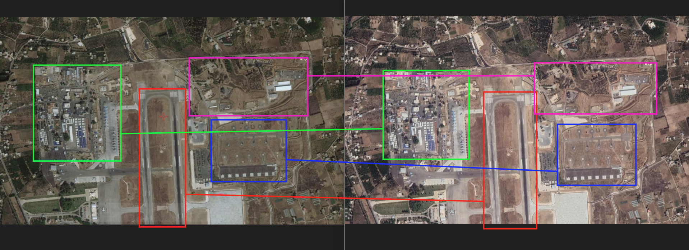
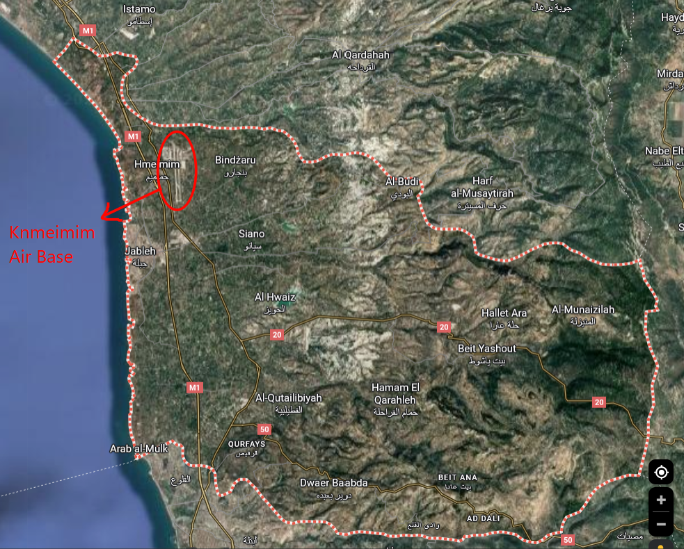

# Cold War Enemies

- Task: Given the satellite image identify the air base and its location (country, governorate, and district)
- Briefing:

> Greetings Special Agent K.
>
> Perhaps you remember our old friend Maksim Kotova? After his capture in Panama he was more than willing to cooperate for reduced sentences.
>
> Following up on the leads he’s given us until this point has resulted in the arrest of several high ranking officials and members of various underground organizations. One of his more promising leads is a military parts smuggling operation organized by one of Maksim’s former Cold War friends, Vasili Semenov.
>
> Semenov is quietly making a fortune selling Russian military spare parts for scraps to the highest bidder. A lot of these parts aren’t even spares in the literal sense of the word. These parts are all brought together through various air bases around Russia and the world, then routed to a central air base. Where they’re exchanged for cash.
>
> Given the current sticky situation around Russian activity. Not to mention the limited jurisdiction of our client. You are tasked with finding the air base where these sales take place. The old man wasn’t very much into modern technology, so all we have for you is a satellite image of the air base. Other items found are sent to a forensics lab by our client.
>
> As always, Special Agent, the contract is yours, if you choose to accept.

## Solution

A quick google image reverse search shows results pointing to this image being a satellite view of the Khmeimim Air Base operated by Russia in governorate Latakia, Syria. The matching characteristics (between the original satellite image and the one on Cctober 9, 2016 in Google Earth Pro) are highlighted below:

However, we also have to look for the district this location belongs to as part of the answer. I did a quick wiki search which reveals the 4 districts in this governorate, being Latakia, Jableh, Qardaha, and Al-Haffah. On google map I search up "[district name] district, Syria" and the result highlights on the map a dotted line around the area the district covers, and that's how I came to find out that the air base was in Jableh district:

- Final answer: `syria-latakia-jableh-khmeimim-air-base`
