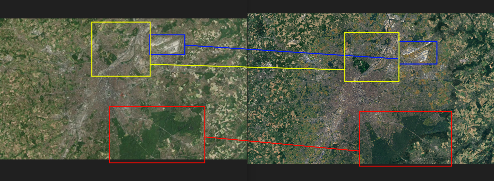

# Gas Attack Challenge

- The task was to find the city and country of the location shown in the satellite image.

- This challenge is pretty straightforward. A quick simple google reverse image search output lots of results that seem to suggest this is a satellite image of the city of Brussels in Belgium. I verify this location in google earth pro, and the characteristics of the city map (highlighted below) does match ones in the original image, although there are slight differences that suggest they are taken at different times:

- Final answer: `belgium-brussels`
