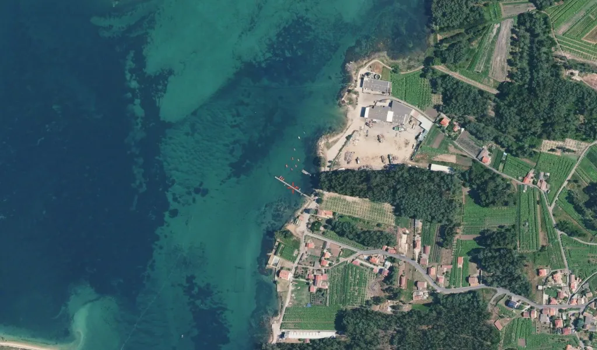
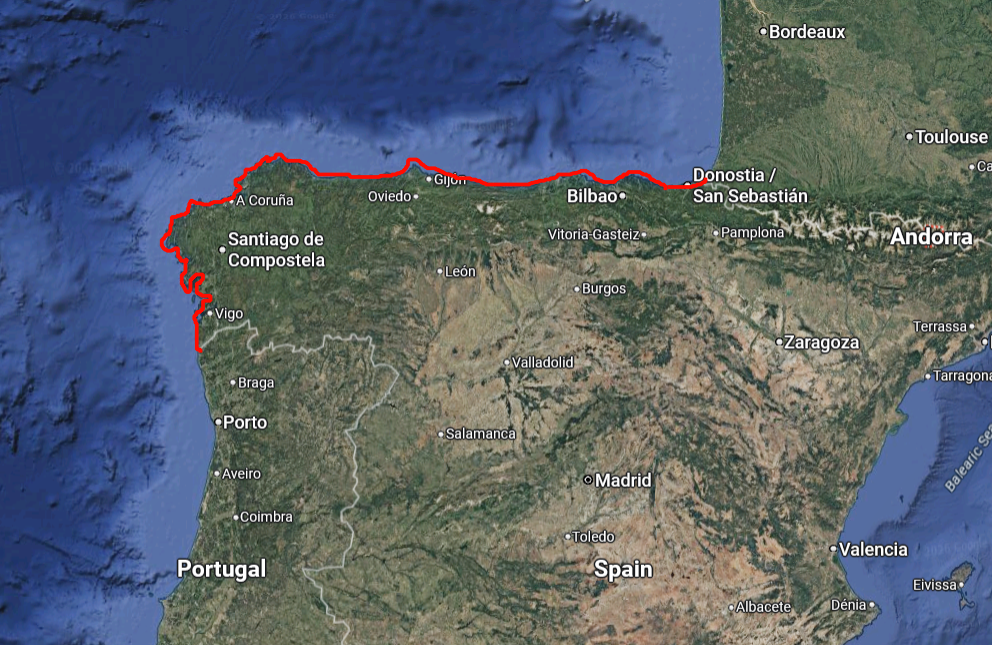
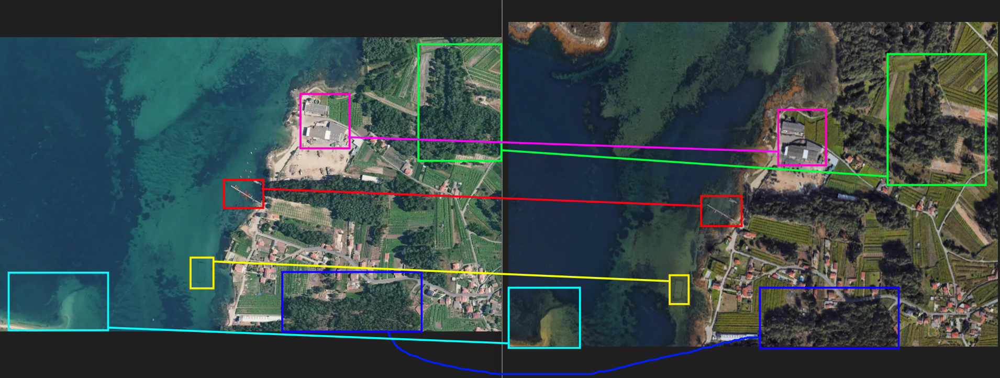
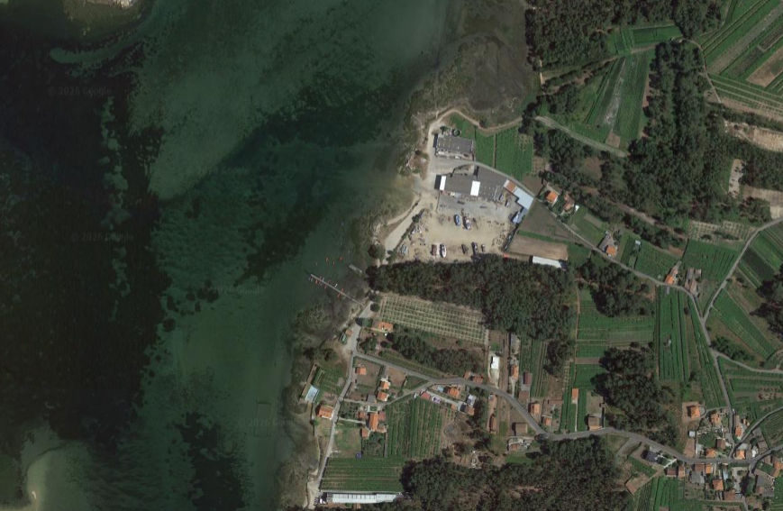

## Briefing

> Greetings, Special Agent.
>
> We’re currently investigating a drug smuggling operation on behalf of the DEA. They are in the process of infiltrating a drug trafficking operation, backed by the Mexican cartels. Moving mostly cocaine from Florida to Spain or France. The group, going by the name “Los Aztecas” adhere to very strict need-to-know policies and practice great opsec. So far we know they don’t inform their runners of a new shipment until a few hours before departure.
>
> The runner is supplied with a note, detailing the location and nothing more. The second in command for that run is provided with the additional information. As a last piece, the final destination isn’t sent until they reach the waters of whatever country they’re going to. Two hours ago, our friends over at the DEA received the latest run information from their informant in Los Aztecas. As you might have guessed, we need you to geolocate the drop point. We have no idea where in the world this is, that’s where your expertise comes in.
>
> As always, Special Agent, the contract is yours, if you choose to accept.

## Process

The first thing I did was run the image through Google Lens Search. Initially, it returned a certain city in Spain (whose name I forgot, as it shows different results each time I searched the image) which was clearly not the correct location after comparing the coastline layout, street patterns, agriculture plots and patches of trees between the two images. However, one thing that was consistent across the results was that they tended to point to different coastal areas in Spain, which aligns with building patterns in certain regions of the country where houses have red roof tiles. This is also a defining feature in Meditteranean architecture, so I kept in mind that this location could be in nearby countries like Croatia or Italy. However, the briefing above suggested that this location was in either France or Spain, so at this stage my bet was on Spain.

I tried several more image searches using Yandex, Tineye, Bing and Google again, but it seemed that there were no exact visual matches, so I started looking for clues to narrow down the region in Spain where this place could be located. I checked out the guide on Spain on [PlonkIt](https://www.plonkit.net/), a website created by Geoguessr enthusiasts with very comprehensive guides on identifying countries based on features such as vegetation, dirt texture, houses and buildings architecture, area codes, and street signs. In the guide to guessing regions in Spain, I read that the northwest region is the greenest and most densely forested area, as opposed to other coastal regions where the terrain is much drier and trees are sparse. After briefly checking this on the map, I decided to start at the northwest region by tracing along Spain’s northern coastline, starting at the Spanish–French border and continuing west to the Portuguese border.

The tracing process took roughly 1.5-2 hours before I stumbled upon Ria de Arousa, and on the coast of O Facho town within Cambados municipality inside the estuary, I found the location. After cross-checking the visual cues between the satellite view of the coast in Google Map view and the original image, I confirmed that this is the exact location.

That being said, I made a mistake by confusing between Pontevedra as a city versus a province, and initially I thought this referred to the coastline of the city instead of Cambados within Pontevedra province. This misunderstanding cost me an additional ten minutes before I arrived at the correct answer, which is `spain-cambados-aldea-o-facho`.

Just for fun, I wanted to approximate the time when this satellite image was taken, as there are some discrepancies in certain areas in the comparison above. Most noticeably, the patches of dense trees highlighted in the green bounding boxes appear different: in the Google Maps satellite view, part of the lower section of this area seems to have had trees cut down to make space for other vegetation. Additionally, the dark blue patches in the sea (most likely dense seagrass meadows) cover a much wider area in the Google Maps view than in the original satellite image, suggesting that the images were taken at different times.

At this point, I switched to Google Earth and checked the historical imagery for this area. An image taken on July 18, 2020 shows the most similarity to the original satellite image, although there are still slight differences in the shape of the tree clusters within the green bounding boxes. In the original image, that area appears more densely covered than in the Google Earth view. Nevertheless, it is very likely that the original satellite image was taken sometime before July 18, 2020. Since this is not part of the challenge, I decided to leave the analysis there.

- Final answer: `spain-cambados-aldea-o-facho`
